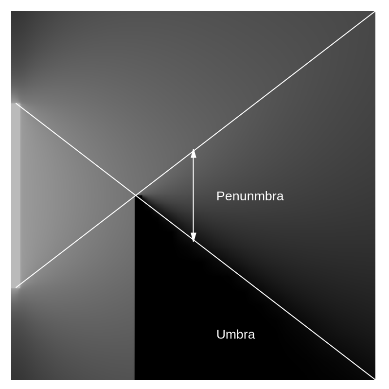
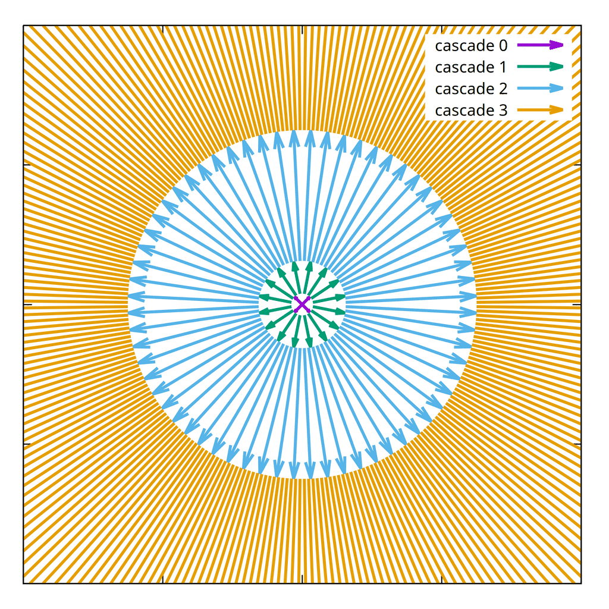
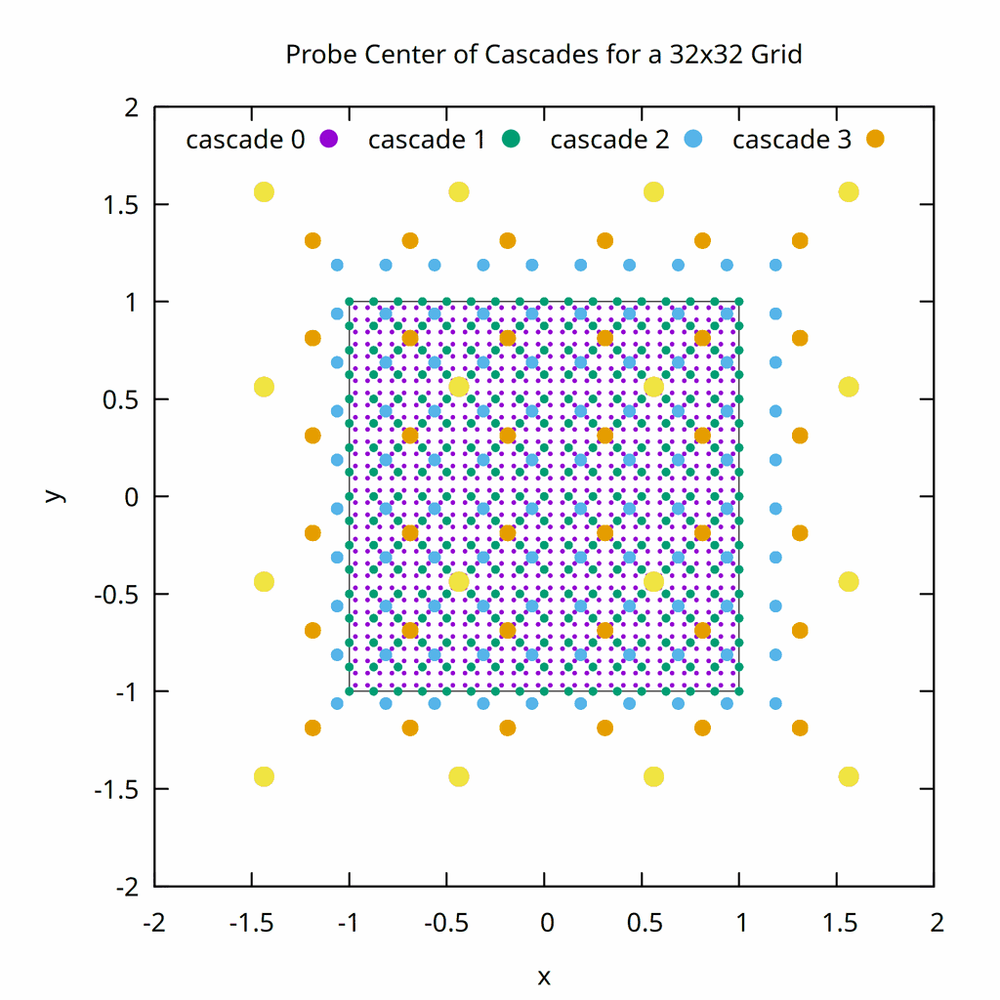
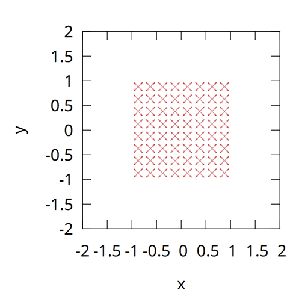
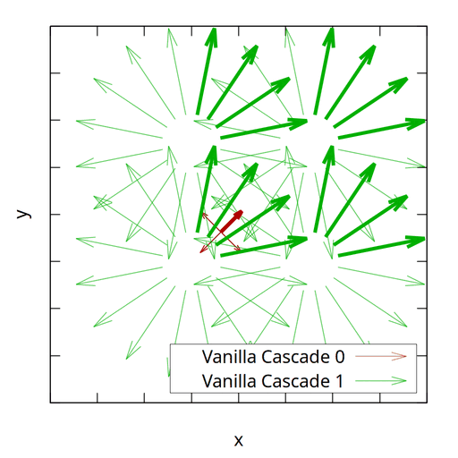
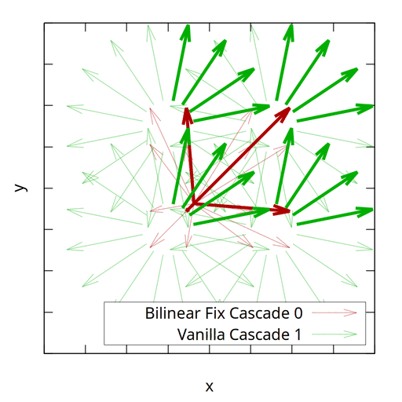

# CoreCascade

A 2D implementation of the Radiance Cascades global illumination technique in Go. This project serves as an experimental platform for understanding and exploring the Radiance Cascades algorithm in a simplified 2D environment.

## Overview

Radiance Cascades is a hierarchical probe-based global illumination technique that efficiently computes lighting by using multiple resolution levels (cascades). 
A good tutorial on the technique can be found [here](https://m4xc.dev/articles/fundamental-rc/).

The benefits of Radiance Cascades include:

* No noise in the final image
* Good convergence against satisfying results
* Scales independent of number of light sources
* Efficiently captures global illumination
* Does run in real-time if implemented on a GPU

Here is a short overview of the technique.

## Path Tracing in 2D

Path tracing is a Monte Carlo ray-tracing technique that fires many random rays from a probe position into a scene to simulate the way light interacts with surfaces. Each ray traces a path through the scene, bouncing off surfaces and gathering color information. 


The final probe color is produced by averaging the contributions of all these rays.
In 2D, these probes are points in the scene arranged on a grid, and rays are cast from these points into the scene.


In the trivial case, each probe sits in the center of a pixel, resulting in several million probes per image. This method is simple but noisy due to its stochastic nature and can be slow to converge. 

### Penumbra Condition (Soft Shadows)

The core insight of Radiance Cascades is exploiting certain geometric properties of light transport:



* We need **less** angular resolution next to the light source
* We need **more** spatial resolution next to the light source

### Angular Component

We discretize the angular space based on the distance to the light probe.

In our example, each cascade level has:
  - 4x more angular directions
  - 2x longer ray intervals



### Spatial Component

Instead of probing all cascades at the same position, we use a hierarchical grid of probes placed at different spatial resolutions.

Each cascade level has approximately:
  - 2x fewer probes and hence lower spatial resolution
  - Probes displaced to the center of the previous cascade level

This image shows the center of each probe at each cascade level:



Cascade 0 depicts the probes with the highest spatial resolution, typically placed at the center of each pixel.

Some spatial probes of the higher cascades fall outside the image boundaries and must be handled appropriately. This occurs because we perform bilinear interpolation between probes of different cascades. For example, the result of probe tracing from cascade i+1 is bilinearly interpolated to the positions of probes in cascade i. Most implementations set the probe trace result to zero (black color) for out-of-bounds probes, which is typically sufficient.

### Combined Angular and Spatial Probes

The result is a hierarchical grid of "probes" at multiple resolutions:



### Merging Cascades

Bilinear interpolation is used to estimate the trace information from cascade i+1 at the probe positions of cascade i:



### Bilinear Fix

The vanilla version has several issues such as ringing and light leaking. Currently, several improvements are being tested to enhance the overall rendering quality. One of the most prominent is the "bilinear fix," which requires casting four times more rays. It traces rays from their usual start position in cascade i to the start position of the child rays in cascade i+1 for each of the four probes. 

For visualization purposes, only the rays from cascade 0 include the bilinear fix, while the rays from cascade 1 remain the same as in the vanilla version:



The bilinear fix significantly improves the results compared to the vanilla version.

## Results

Comparison between different rendering methods in the same scene:


## Features

- **Multiple Rendering Methods**:
  - Path tracing
  - Radiance Cascades rendering
  - Light Propagation Volumes
  - Light Propagation (under development)
- **SDF-based Scene Representation**: Uses Signed Distance Fields for flexible object representation

## Getting Started

### Building

Build directly:
```bash
cd src && go build -o ../CoreCascade
```

### Running

To see available options:
```bash
./CoreCascade --help
```

## Scene Definition

Scenes use Signed Distance Fields (SDFs) with the following primitives:
- **Circle**: Defined by center, radius, and color
- **Box**: Axis-aligned box with center, dimensions, and color

## References

See `links.md` for an extensive collection of:
- Original papers and research
- Implementation references in various languages
- Tutorial articles and blog posts
- Community resources and discussions

## License

This project is licensed under the MIT License - see the [LICENSE](LICENSE) file for details.
